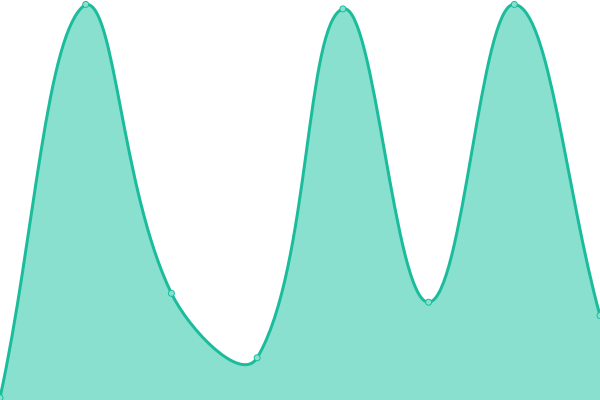
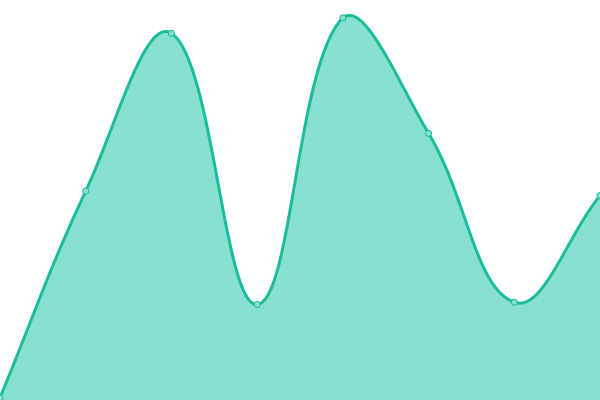

# 

This repository contains the open-source uptime monitor and status page for [Qrono-Labs](https://status.qrono.dev), powered by [Upptime](https://github.com/upptime/upptime).

With [Upptime](https://upptime.js.org), you can get your own unlimited and free uptime monitor and status page, powered entirely by a GitHub repository. We use [Issues](https://github.com/Qrono-Labs/uptime/issues) as incident reports, [Actions](https://github.com/Qrono-Labs/uptime/actions) as uptime monitors, and [Pages](https://status.qrono.dev) for the status page.

## How it works:

<!--start: status pages-->
<!-- This summary is generated by Upptime (https://github.com/upptime/upptime) -->
<!-- Do not edit this manually, your changes will be overwritten -->
<!-- prettier-ignore -->
| URL | Status | History | Response Time | Uptime |
| --- | ------ | ------- | ------------- | ------ |
|  [Qrono API](https://qrono.dev/api/) | 🟥 Down | [qrono-api.yml](https://github.com/Qrono-Labs/uptime/commits/HEAD/history/qrono-api.yml) | 

 0ms
     
 | 

<a href="https://status.qrono.dev/history/qrono-api">0.00%</a>
    

|  [Qrono Site](https://qrono.dev/) | 🟥 Down | [qrono-site.yml](https://github.com/Qrono-Labs/uptime/commits/HEAD/history/qrono-site.yml) | 

 0ms
     
 | 

<a href="https://status.qrono.dev/history/qrono-site">0.00%</a>
    

|  [Qrono Dashboard](https://qrono.dev/dashboard/) | 🟥 Down | [qrono-dashboard.yml](https://github.com/Qrono-Labs/uptime/commits/HEAD/history/qrono-dashboard.yml) | 

 0ms
     
 | 

<a href="https://status.qrono.dev/history/qrono-dashboard">0.00%</a>
    

|  [Qrono-hosted Booking Pages](https://book.qrono.dev/demo) | 🟥 Down | [qrono-hosted-booking-pages.yml](https://github.com/Qrono-Labs/uptime/commits/HEAD/history/qrono-hosted-booking-pages.yml) | 

 0ms
     
 | 

<a href="https://status.qrono.dev/history/qrono-hosted-booking-pages">0.00%</a>
    

|  [Qrono Docs](https://docs.qrono.dev/) | 🟥 Down | [qrono-docs.yml](https://github.com/Qrono-Labs/uptime/commits/HEAD/history/qrono-docs.yml) | 

 0ms
     
 | 

<a href="https://status.qrono.dev/history/qrono-docs">0.00%</a>
    

<!--end: status pages-->

[**Visit our status website →**](https://status.qrono.dev)

## 📄 License

- Powered by: [Upptime](https://github.com/upptime/upptime)
- Code: [MIT](./LICENSE) © [Qrono-Labs](https://status.qrono.dev)
- Data in the `./history` directory: [Open Database License](https://opendatacommons.org/licenses/odbl/1-0/)
